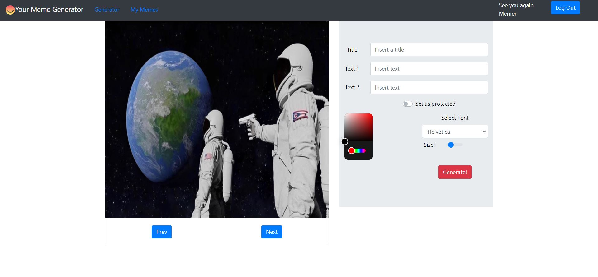

# Exam #2: "Meme Generator"
## Student: s281697 ERNESTO CRISTIAN

## React Client Application Routes

- Route `/`: Dashboard -> when you start the app the user will see all the public memes.
- Route `/`: Dashboard -> when you're logged in the user will see all the public and private memes.
- Route `/MemeGenerating` -> if the user is not logged in they will be redirect to login page, otherwise is loaded the meme creation page.
- Route `/MemeGenerating` -> if the user clicks from dashboard a copy meme button it's redirect to this route.
- Route `/MyMemes` -> if the user is not logged in they will be redirect to login page, otherwise are loaded all the memes of the       specified user (this is the page where a user can delete a meme).
- Route `/login` -> if the user is not logged in it's loaded the login page, otherwise a Page not found page is loaded in order to return to the home page `/`.


## API Server


- GET `/api/memes` \+ [`/public` , `/user`]
  - request parameters : * No params*
  - response body content : An array of objects. If `/api/memes` returns an array of memes (public and protected). If `/api/memes/public` returns an array of public memes. If `/api/memes/user` returns an array of memes of the specified user.
   ```
   /api/memes
    [{
        "id": 19,
        "id_template": 5,
        "title": "Prova",
        "text0": "Polito server",
        "text1": "My trash app",
        "text2": NULL,
        "text3": NULL,
        "color": "#000000",
        "font": "helvetica",
        "size": "8",
        "isProtected": 0,
        "image": "iVBORw0KGgoAAAANSUhEUgAABqsAAAMiCAYAAAD5CvnXAAA...",
        "user": 1
      }, {
        "id": 23,
        "id_template": 3,
        "title": "Meme 1",
        "text0": "Non sai la storia del negozio?",
        "text1": "Ti insegno io come si fa",
        "text2": "Domani al posto di prendere 3 euro",
        "text3": "Ne fai 30 facendo la guida",
        "color": "#000000",
        "font": "helvetica",
        "size": "8",
        "isProtected": 1,
        "image": "VBORw0KGgoAAAANSUhEUgAABqsAAAMiCAYAAAD5Cvn...",
        "user": 1
      },
    ...
    ]
   ```
   ```
   /api/memes/public
  [{
      "id": 19,
      "id_template": 5,
      "title": "Prova",
      "text0": "Polito server",
      "text1": "My trash app",
      "text2": NULL,
      "text3": NULL,
      "color": "#000000",
      "font": "helvetica",
      "size": "8",
      "isProtected": 0,
      "image": "iVBORw0KGgoAAAANSUhEUgAABqsAAAMiCAYAAAD5CvnXAAA...",
      "user": 1
    }, {
      "id": 25,
      "id_template": 2,
      "title": "meme luca",
      "text0": "get a job",
      "text1": "get a life",
      "text2": NULL,
      "text3": NULL,
      "color": "#030303",
      "font": "helvetica",
      "size": "10",
      "isProtected": 0,
      "image": "iVBORw0KGgoAAAANSUhEUgAABqsAAAMiCAYAAAD5CvnXA...",
      "user": 3
    },
  ...
  ]
   ```
   ```
   /api/memes/user
  [{
      "id": 19,
      "id_template": 5,
      "title": "Prova",
      "text0": "Polito server",
      "text1": "My trash app",
      "text2": NULL,
      "text3": NULL,
      "color": "#000000",
      "font": "helvetica",
      "size": "8",
      "isProtected": 0,
      "image": "iVBORw0KGgoAAAANSUhEUgAABqsAAAMiCAYAAAD5CvnXAAA...",
      "user": 1
    }, {
      "id": 23,
      "id_template": 3,
      "title": "Meme 1",
      "text0": "Non sai la storia del negozio?",
      "text1": "Ti insegno io come si fa",
      "text2": "Domani al posto di prendere 3 euro",
      "text3": "Ne fai 30 facendo la guida",
      "color": "#000000",
      "font": "helvetica",
      "size": "8",
      "isProtected": 1,
      "image": "VBORw0KGgoAAAANSUhEUgAABqsAAAMiCAYAAAD5Cvn...",
      "user": 1
    },
  ...
  ]
 
 
- GET `/api/session/current`
  - request parameters: *No params*
  - response body content: the current user that is logged in.
    ```
    {
    "id":1,
    "username":"ciao@gmail.com",
    "name":"cristian"
    }
    ```

- POST `/api/memes`
  - request parameters and request body content : the meme object.
  - request body content: 
    ```
    {
        "id_template": 5,
        "title": "Prova",
        "text0": "Polito server",
        "text1": "My trash app",
        "text2": NULL,
        "text3": NULL,
        "color": "#000000",
        "font": "helvetica",
        "size": "8",
        "isProtected": 0,
        "image": "iVBORw0KGgoAAAANSUhEUgAABqsAAAMiCAYAAAD5CvnXAAA..."
      }
    ```
  - response body content : `201` OR `503`
    ```
    {
      error: `Database error during the creation of meme: title`
      
    }
    ```
    
- POST `/api/sessions`
  - request parameters and request body content : the credentials to login.
   ``` 
    {
        "username": "ciao@gmail.com",
        "password": "ciaociao"
    }
   ```
 - response content : `200 `
- DELETE 
  - request body and request body content: *No params*
  - response body and response body object: `204` (success) OR `503`
   ```
    error: `Database error during the deletion of meme: id`
   ```
- DELETE `/api/sessions/current`
  - request parameters and request body content : *No params*
  - Response: `200` (success) OR `400 Unauthorized` (user not logged in and tries to logout).


## Database Tables

- Table `users` - contains id, email, name, password. ( This table contains all the info of users ).
- Table `memes` - contains id, id_template (the index of the Template_Array), title, text0, text1, text2, text3, color ( color of the font ), font, size ( size of the font ), is_Protected (0 means public 1 protected), image ( the meme translated in data url ), user ( the foreign key of table users ).


## Main React Components

- `Dashboard` (in `Dashboard.js`): the dashboard displayed with all the memes, it loads MemeTable component. 
- `MemeTable` (in `Memetable.js`): the actual list of memes, it loads MemeRow.
- `MemeRow` (in `Memetable.js`): MemeRow is a bootstrap Card component with an image, a title, the creator, the privacy and if logged in a button to copy that specified meme (redirect to '/MemeGenerating').
- `MemeGenerating` (in `MemeGenerating.js`): the page with the purpose of create a meme. It's composed by a Canvas that displays the image and a Jumbotron bootstrap component with the forms (for title and texts), a color picker, a switch for the privacy, size slider, and font picker. The buttons: 'next' 'prev' are displayed if the creator is generating a meme, not in case of copy. 'Generate!' creates the meme and then redirect to '/'.
- `Canvas` (in `Canvas.js`): it's an html canvas with a background image and a text overlapped ( the meme ).
- `MyMemes` (in `MyMemes.js`): a list of memes of the logged creator where they can delete their memes.

## Screenshot



## Users Credentials


| email | password | memes |
|-------|----------|------|
| ciao@gmail.com | ciaociao | Prova, Meme 1, Pick one, Airport Security, copia meme luca |
| ehi@gmail.com | ehiehi | Meme 2, Spider, Copia Polito life, Meme 3 |
| prova@gmail.com | provaprova | meme luca, Polito life, Copia meme cristian |
